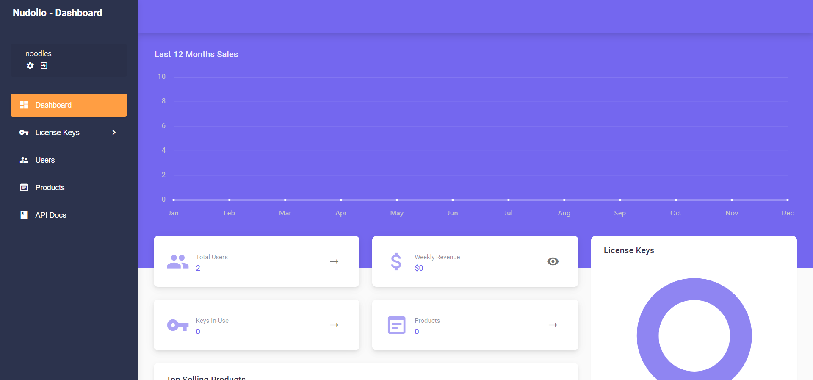
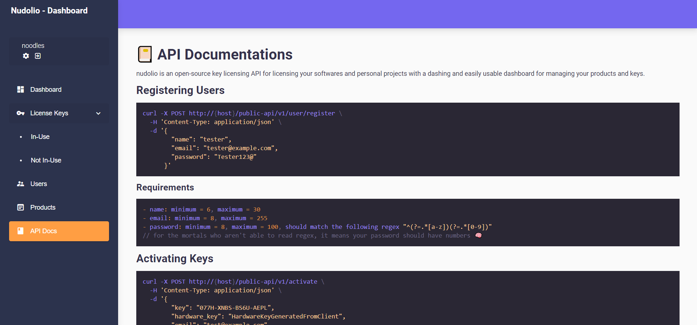

# nudolio
open source software license key manager built with MERN & redux with a web api to build on

        
<br />
<br />
 
<br />

> Theme Used: [MatX](https://github.com/uilibrary/matx-react)

#### [Click Here for Demo](https://nudolio.herokuapp.com/)

## Features
- Public API (Express)
  - Key Activation
  - User Registration
- Web Manager (React)
  - JWT Authentication
  - Dashboard Analytics
    - Sales Graph
    - Most Sold Products
    - Revenue Information
    - Clients
    - Web Api Requests
    - License Keys
  - License Key Management
    - Assignment
    - Export to CSV
    - Mass Key Generation/Deletion
  - Product Management
  - User Management
  - Search Functionalities
    - Keys
    - Products
    - Users
  - Ease of Use
  - API Documentation
  - UI Built with [MatX](https://github.com/uilibrary/matx-react) & [Material-UI](https://github.com/mui-org/material-ui)

## Build
You can edit the Web Documentation on `client\src\app\views\api\docs.md`

Building the react-app
```sh
cd client
npm run build
mv build ../server/build
```
Starting the express server
```sh
cd server
npm start
```

## Config

Edit the `.env` file in `server/` directory
```env
DB_CONNECTION = mongodb_url_here
# add token secret
TOKEN_SECRET = ChAnGe_mE_123
ACCESS_TOKEN_TIME = 3060
# do not edit API_VERSION
API_VERSION = v1
```
Build on the key activation logic in `server/routes/public.js` before adding any keys
